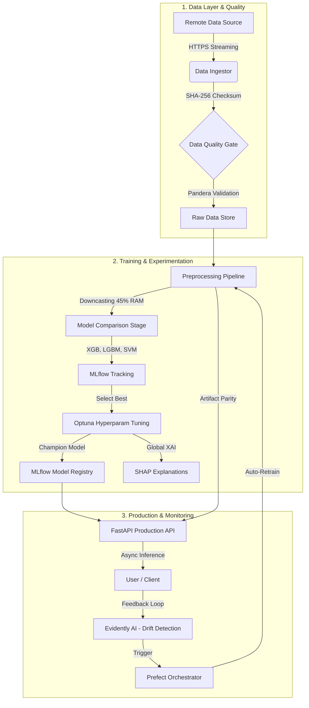
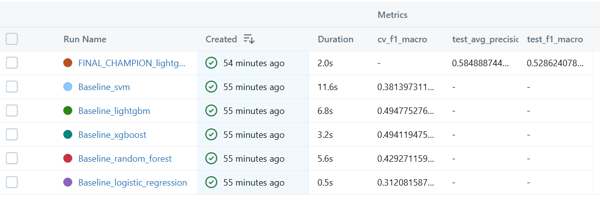
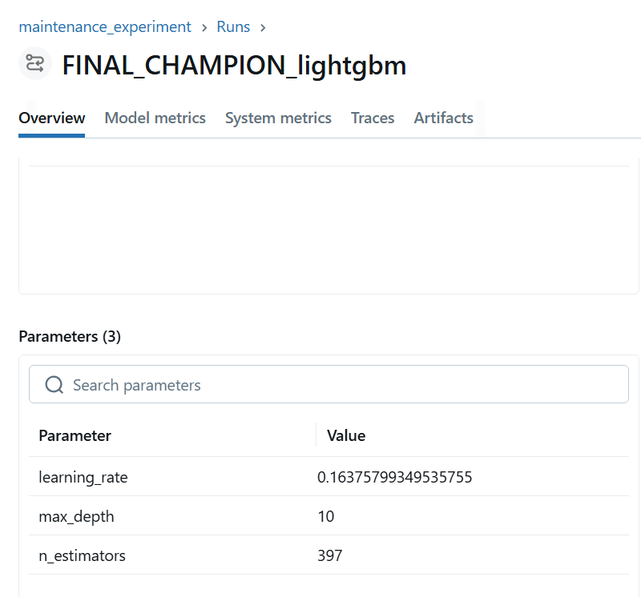
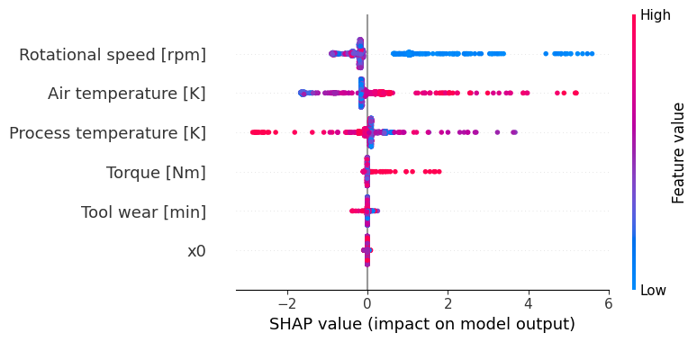
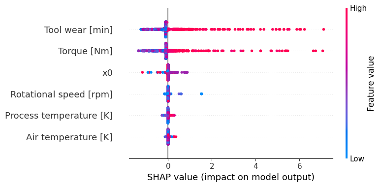
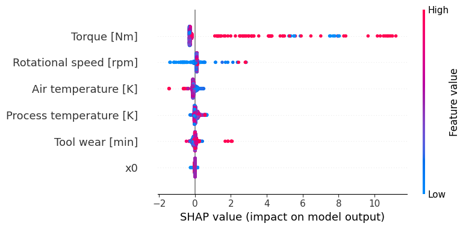
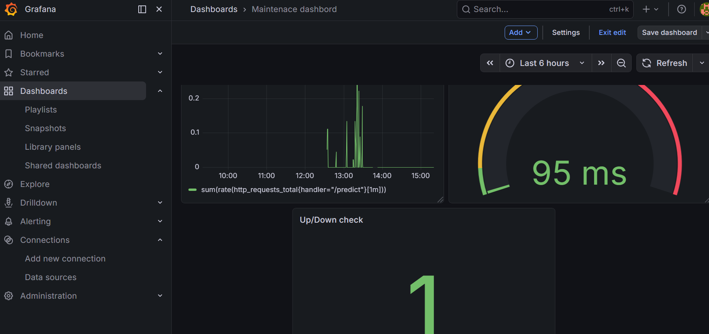
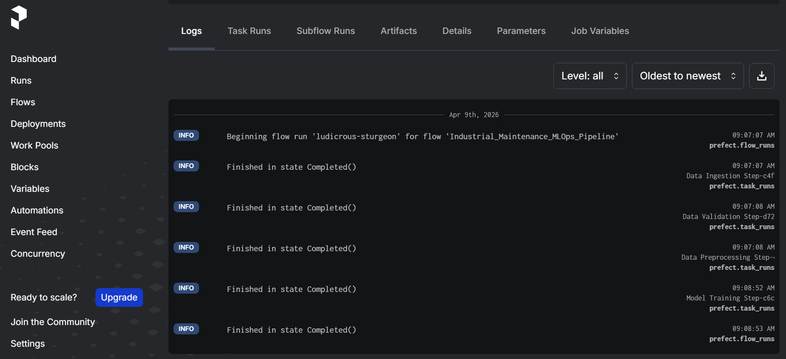
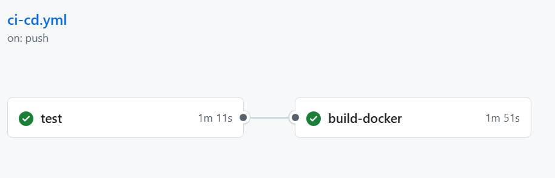

# 🚀 End-to-End Multi-label MLOps: Industrial Predictive Maintenance
[](https://github.com/ngahyves/End_to_end_predictive_maintenance_system/actions/workflows/ci-cd.yml)

> **Objective:** Transitioning from experimental notebooks to a resilient, production-ready system. This project predicts 5 specific failure modes simultaneously while optimizing for low-latency serving and infrastructure cost-efficiency.

## 📊 Key Results & Engineering Impact
*   **Best Model:** LightGBM (MultiOutput Architecture) optimized via **Optuna**.
*   **Performance:** Achieved **0.53 F1-Macro** and **0.58 Avg Precision** (Robust on rare failure classes).
*   **Infrastructure:** Reduced memory footprint by **45%** (0.84MB → 0.46MB) via strategic type downcasting.
*   **Latency:** Optimized for **< 95ms** P95 inference in production.
*   **Reliability:** 100% Data Schema enforcement via **Pandera** quality gate.
*   **Automation:** Fully autonomous feedback loop with **Prefect** and **Evidently AI**.

**Tech Stack:** `Python`, `LightGBM`, `FastAPI`, `Docker`, `MLflow`, `Optuna`, `Pandera`, `SHAP`, `Prefect`, `Prometheus`, `Grafana`, `Evidently`, `Pydantic`.

---

## 🏗 System Architecture

---

## 🛠 Engineering Excellence
1. Resilient Ingestion & Validation

Built a defensive ingestion engine using Chunked Streaming to handle any dataset size with constant RAM usage.

    Integrity: Automatic SHA-256 verification and self-healing logic.

    Quality Gate: Pandera schemas block "Garbage In" at the earliest stage.

2. Scalable Preprocessing & Training

    Training-Serving Parity: Used Scikit-Learn ColumnTransformer saved as a versioned artifact to ensure production data is transformed exactly as training data.

    Experiment Tracking: 100% of hyperparameters, metrics, and models are versioned in the MLflow Model Registry.

<p align="center">
  
  
</p>

3. Responsible AI (Explainability)

Integrated SHAP to provide transparency. The system generates diagnostic reports for each failure type (HDF, OSF, PWF), allowing operators to understand why an alert was triggered.
<p align="center">



</p>
📈 Monitoring & Observability
Real-time Performance (Prometheus & Grafana)

We monitor the P95 Latency to ensure the system meets industrial requirements. The "stepping" descent in the graph demonstrates the sliding window efficiency of our monitoring.
<p align="center">


</p>
Data Drift Detection (Evidently AI)

Automated statistical monitoring to detect shifts in sensor distributions (e.g., sudden temperature increases) and trigger retraining flows.
<p align="center">
  
</p>

<p align="center">
  <a href="reports/evidently_monitoring/drift_report.html">🔗 View Full Interactive Drift Report</a>
</p>

⚙️ Workflow Orchestration (Prefect)

The entire pipeline is automated. Prefect ensures that if a stage fails (e.g., network error or schema mismatch), the system alerts the team and manages retries autonomously.
<p align="center">

</p>
🧪 Testing & CI/CD

I maintain a 100% pass rate on CI/CD for Unit, Integration, and Infrastructure tests.

    Unit Tests: Data validation logic and preprocessing shapes.

    Integration Tests: API endpoints and Model loading stability.

    Infrastructure: Docker multi-stage build validation.

<p align="center">

</p>
## 📦 How to Run

### 1. Clone the repo
```bash
git clone https://github.com/ngahyves/End_to_end_predictive_maintenance_system.git
cd End_to_end_predictive_maintenance_system
``` 

### 2. Launch the stack
```bash
docker compose -f deployment/docker-compose.yml up --build
``` 

```bash
# Run Unit & Integration Tests
python -m pytest
```

🧠 Why this project stands out?

Most ML projects end in a notebook. This project is a robust software system. It handles the critical parts of real-world AI: Resilience (Retry logic), Integrity (Pandera), Efficiency (RAM Optimization), and Trust (SHAP).