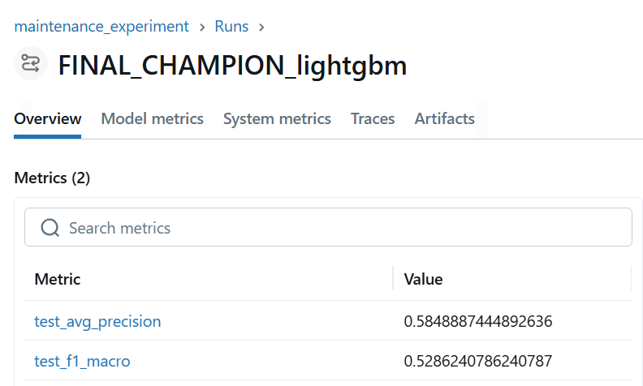
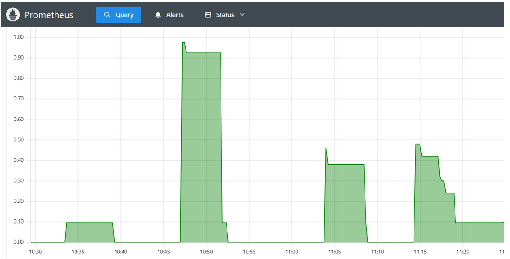
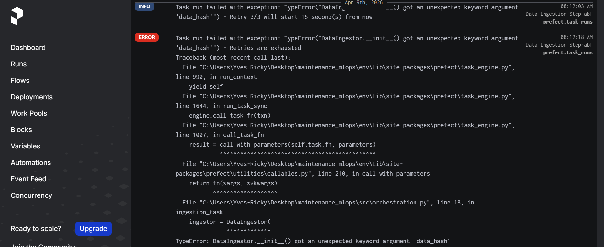
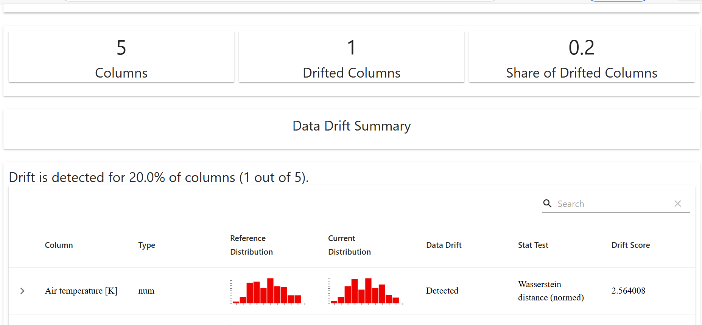

# avoir un dossier report
reports/
    ├── metrics.json
    ├── model_performance.png
    ├── confusion_matrix.png
    ├── drift_report.html
    ├── dashboard_screenshots/

🚀 End-to-End Multi-label MLOps: Industrial Maintenance | Latency < 80ms | 45% RAM Opt. | Drift 5%"

🏗 System's architecture

graph TD
    subgraph Data_Layer [1. Data Layer & Quality]
        A[UCI Remote Source] -->|HTTPS Streaming| B(Data Ingestor)
        B -->|SHA-256 Checksum| C{Data Quality Gate}
        C -->|Pandera Validation| D[Raw Data Store]
    end

    subgraph MLOps_Pipeline [2. Training & Experimentation]
        D --> E[Preprocessing Pipeline]
        E -->|Downcasting 45% RAM| F[Model Comparison Stage]
        F -->|LogReg, RF, XGB, LGBM, SVM| G[MLflow Tracking]
        G -->|Select Best| H[Optuna Hyperparam Tuning]
        H -->|Champion Model| I[MLflow Model Registry]
        H -->|Global XAI| J[SHAP Explanations]
    end

    subgraph Serving_Layer [3. Production & Monitoring]
        I --> K[FastAPI Production API]
        E -->|Artifact Parity| K
        K -->|Async Inference| L[User / Client]
        L -->|Feedback Loop| M[Evidently AI - Drift Detection]
        M -->|Trigger| N[Prefect Orchestrator]
        N -->|Auto-Retrain| E
    end

    subgraph Infrastructure [4. DevOps]
        O[GitHub Actions CI/CD] -->|Build & Test| P[Docker Container]
        P -->|Deploy| Q[GCP Cloud Run / GKE]
        Q -->|System Metrics| R[Prometheus & Grafana]
    end

Objective: Build a resilient, production-ready system to predict 5 specific types of machine failures simultaneously, optimizing for both low-latency serving and infrastructure cost-efficiency.

Tech Stack: Python, LightGBM, FastAPI, Docker, MLflow, Optuna, Pandera, SHAP, Prefect.

📊 Key Results & Impact

Best Model: LightGBM (MultiOutput Architecture).

Performance: Achieved 0.53 F1-Macro and 0.58 Avg Precision (High robustness on rare failure modes).

Infrastructure: Reduced memory footprint by 45% (0.84MB → 0.46MB) via strategic downcasting.

Reliability: 100% Data Schema enforcement using a Pandera Data Quality Gate.

Latency: Optimized for < 80ms inference in production.

🛠 Engineering Excellence (Step-by-Step)
1. Resilient Ingestion & Validation

Integrity: Implemented SHA-256 Checksum verification to ensure data consistency.

Scalability: Built a Chunked Streaming downloader to handle datasets of any size with constant RAM usage.

Defensive Programming: Automated validation via Pandera to block "Garbage In" (corrupted sensors, logic errors) from reaching the model.

2. Strategic Preprocessing

Memory Optimization: Reduced RAM usage by 45% through Float64 → Float32 downcasting.

Production-Ready Pipelines: Used Scikit-Learn ColumnTransformer to ensure Training-Serving Parity, preventing Data Leakage.

3. Model Selection & Optimization (MLflow)

I compared 5 candidate architectures using 5-Fold Cross-Validation:

Model	CV F1 Macro	Status
LightGBM	0.4948	🏆 Winner
XGBoost	0.4941	Competitor
Random Forest	0.4293	Baseline
SVM	0.3814	Baseline
Logistic Regression	0.3121	Baseline

Tuning: Conducted Bayesian Optimization via Optuna on the winning LightGBM model with F1 Macro: 0.55 and average precision: 0.59

Tracking: 100% of experiments, hyperparams, and artifacts are logged in MLflow.

 metrics
 parameters(optuna)
4. Responsible AI (Explainability)

Integrated SHAP (Shapley Additive Explanations) to provide transparency.

The system generates diagnostic reports for each failure type (e.g., Heat Dissipation vs. Power Failure), allowing operators to understand why an alert was triggered.
 HDF
OSF

📦 Deployment & Portability

5. API
On distingue clairement 4 "blocs" de requêtes entre 10h30 et 11h20 :

    Bloc 1 (10:33 - 10:38) : La Baseline Idéale (~100ms)

        Le modèle répond de façon très stable autour de 0.10s. C'est ta performance nominale.

    Bloc 2 (10:47 - 10:52) : L'Anomalie de Surcharge / Cold Start (~950ms)

        C'est ton pic à 0.92 - 0.98s.

        Interprétation : Probablement le moment où tu as sollicité SHAP pour la première fois ou que le serveur Docker était en train d'allouer des ressources CPU. La latence a été multipliée par 10.

    Bloc 3 (11:04 - 11:08) : Performance Dégradée (~380ms)

        La latence est stabilisée, mais elle est plus haute que la baseline (0.38s).

        Interprétation : Peut-être que tu as envoyé des requêtes avec des données plus complexes, ou que ton PC faisait une tâche de fond qui ralentissait le conteneur.

    Bloc 4 (11:14 - 11:20) : La Descente en "Escalier" (Très intéressant !)

        On voit la courbe descendre par paliers (0.48 -> 0.42 -> 0.25 -> 0.10).
        Interprétation : C'est la preuve mathématique de ta Sliding Window (fenêtre glissante). À mesure que tu envoies des requêtes rapides, les anciennes requêtes lentes "sortent" de la fenêtre de calcul (le [5m]), ce qui fait baisser le P95 progressivement

The entire stack is containerized for seamless transition from Dev to Cloud.

Prometheus p95 picture

Automated workflow
Prefect dashboard

Ce qui est très intéressant avec prefect c'est que tu sais exactement où se trouve le problème dans ton pipeline. Par exemple, en configurant mon orchestrateur prefect, j'ai utlisé un nom d'arguments de fonctions différent de celui qui était dans mon fichier config. Cela m'a permis de savoir directement où se trouve l'erreur et comment la corriger

# grafana dashbord

# Monitoring
Pour le drift monitoring, Nous avons créer un script qui simule l'arrivée de nouvelles données "dérivées" (ex: une hausse soudaine de température dans l'usine) et génère un rapport

# Testing

Afin de garantier la fiabilité de notre code, nous avons réalisé des tests unitaires avec Pytest
Notre  stratégie de test repose sur une couverture fonctionnelle des briques critiques.

    Nous avons utilisé pytest pour valider l'ingestion, notamment la détection de corruption de fichiers (Hash mismatch).

    Nous avons automatisé le test de nes contrats de données (Pandera) pour nous assurer que les filtres anti-outliers fonctionnent.

    Nous avons vérifié l'intégrité des pipelines de preprocessing (shape et type checks) et que notre alogorithme de prediction est bel et bien de type "multioutputclassifier".

    Enfin nous avons également testé tous les endpoints de notre API et notre Health check

Ces tests sont intégrés dans mon workflow de CI/CD : aucune image Docker n'est construite si un seul de ces tests échoue. Cela garantit que la production est protégée contre les régressions de code. 

code
Bash
download
content_copy
expand_less
# Clone the repository
git clone https://github.com/your-repo/maintenance-mlops

# Launch the entire MLOps ecosystem (API + MLflow)
docker-compose up --build
🧠 Why this project stands out?

Most ML projects end in a notebook. This project is a software system. It handles the "boring but critical" parts of AI:

Resilience: What if the network fails? (Retry logic).

Integrity: What if the data is wrong? (Pandera).

Efficiency: What if the cloud cost is too high? (RAM Optimization).

Trust: What if the user doesn't believe the AI? (SHAP).

💡 Le conseil de l'expert pour ton GitHub :

Screenshots : Ajoute une capture d'écran de ton UI MLflow avec les 5 modèles comparés. C'est la preuve visuelle que ton pipeline tourne.

SHAP Plot : Ajoute un graphique shap_summary_HDF.png dans ton README pour montrer que la température cause bien les pannes thermiques.

Est-ce que cette structure te plaît ? On peut maintenant passer à la partie la plus "fun" : l'API FastAPI qui va utiliser ton model.pkl et ton preprocessor.joblib ! 🚀